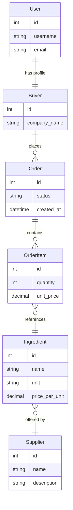
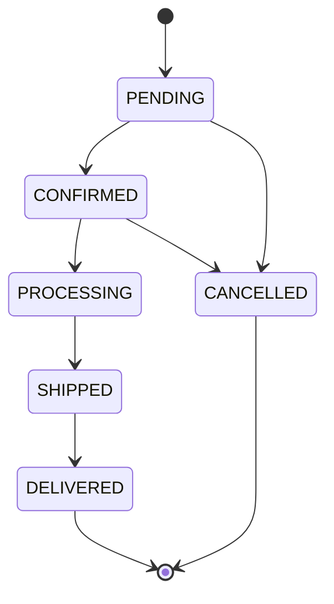

# Opply Code Challenge Template

## Overview

Opply is a B2B procurement platform that connects **Buyers** (food & beverage brands) with **Suppliers** (ingredient manufacturers and distributors). Opply acts as a merchant of record — buyers order through Opply's platform, and Opply manages the supplier relationships, pricing, and fulfilment coordination.

This repository is a minimal but real working application exposing Opply's core domain. During your session, you will be given a specific use case to implement on top of this scaffold.

---

## Domain Model



### Order State Machine



---

## Repository Structure

```
code-challenge-template/
├── docker-compose.yml
├── backend/                  # Django + DRF API
│   ├── opply/                # Django project settings & urls
│   ├── suppliers/            # Supplier model, API
│   ├── buyers/               # Buyer profile model, API
│   ├── ingredients/          # Ingredient model, API
│   ├── orders/               # Order + OrderItem + state machine
│   └── core/                 # Shared management commands (seed)
└── frontend/                 # Vue 3 + Vite + TypeScript SPA
    └── src/
        ├── views/            # LoginView, Dashboard, Suppliers, Orders
        ├── services/         # Axios API clients
        ├── composables/      # useAuth
        └── types/            # Shared TypeScript interfaces
```

---

## Getting Started

### Docker (Recommended)

```bash
docker compose up
```

- Backend: http://localhost:8000
- Frontend: http://localhost:5173

The backend automatically runs migrations and seeds demo data on every start. The seed is idempotent. Both services support live reload — edit a `.py` file and the backend reloads; edit a `.vue` file and Vite HMR updates the browser instantly.

### Manual — Backend

```bash
cd backend
python -m venv .venv
source .venv/bin/activate
pip install -r requirements.txt
cp .env.example .env
python manage.py migrate
python manage.py seed
python manage.py runserver
```

### Manual — Frontend

```bash
cd frontend
npm install
cp .env.example .env
npm run dev
```

---

## API Endpoints

| Method | Path | Auth | Description |
|--------|------|------|-------------|
| POST | `/api/auth/login/` | No | Obtain auth token |
| GET | `/api/buyers/me/` | Token | Current buyer profile |
| GET | `/api/suppliers/` | Token | List all suppliers |
| GET | `/api/suppliers/<id>/` | Token | Supplier detail |
| GET | `/api/suppliers/<id>/ingredients/` | Token | Ingredients for a supplier |
| GET | `/api/ingredients/` | Token | All ingredients |
| GET, POST | `/api/orders/` | Token | List / create orders |
| GET | `/api/orders/<id>/` | Token | Order detail with items |
| POST | `/api/orders/<id>/transition/` | Token | Advance order state |

All authenticated endpoints require the header:
```
Authorization: Token <token>
```

---

## Demo Credentials

| Field | Value |
|-------|-------|
| Username | `demo` |
| Password | `demo1234` |
| Company | Demo Buying Co. |

Django admin: http://localhost:8000/admin/ (same credentials)

---

## Before Your Session

Before you start implementing the use case:

1. Set up any quality guardrails you consider appropriate for both the backend and frontend.
2. Configure your preferred AI coding tool so it understands the project well enough to assist you effectively.

This setup is part of the assessment. We expect it to reflect your proficiency with the tooling — we will discuss your choices during the session.
